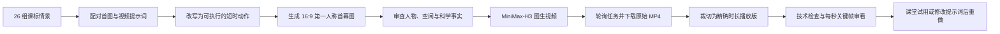

# POV 教学视频生成工作流与产物留存说明

更新时间：2026-09-12

## 当前交付状态

本轮已跑通“教学情景提示词 → 第一人称首幕图 → MiniMax-H3 图生视频 → 本地下载 → 技术检查 → 教学审看”的完整链路。

- 原始题库：26 组首幕图提示词和对应视频提示词。
- 已生成首幕图：3 张，编号 01、04、20。
- 已生成 5 秒试片：3 条，每条均保留 MiniMax 原始文件和精确 5 秒播放版。
- 已生成 15 秒多分镜成片：1 条《望庐山瀑布》，同时保留原始文件和精确 15 秒播放版。
- 所有生成结果均已下载到本目录，不依赖在线临时链接才能播放。
- 当前目录约 32 MB。

## 工作流总览



## 一、整理原始教学情景

输入文档位于培训目录：

- `02_新课标映射/02e_首幕图POV提示词_26条.md`
- `02_新课标映射/02f_首幕视频POV提示词_26条.md`

`prepare.py` 按编号配对两份文档，为每个场景生成：

1. 首图原始提示词；
2. 视频原始提示词；
3. 适合 5 秒生成的动作节拍；
4. 科学性、安全性和教学使用备注；
5. `manifest.json` 中的任务状态记录。

26 组整理稿保存在 `prompts/01.md` 至 `prompts/26.md`。`prepare.py` 会重写提示词目录、清单和 README，因此不要在当前已有成果的目录中重新执行；若要重新整理，应复制脚本到新的批次目录运行。

## 二、设计首幕图

首幕图承担视频的一致性锚点，重点固定以下内容：

- 第一人称视角和双手位置；
- 主体物体、空间关系与视线方向；
- 时间、天气、光线和画面风格；
- 视频第一秒即将发生的动作起点；
- 16:9 横画幅，不加入字幕、可辨文字和水印。

本轮用内置图像生成工具完成 3 张试图，实际模型 ID 未公开，因此这些图片不能标注为 `gpt-image-2.5`。实际采用的扩写提示词保存在 `image_generation_prompts.md`，图片保存在 `images/`。

图片生成后先检查再付费生成视频。尤其要检查手指数量、持物姿态、门轴方向、仪器结构和可能造成学科误解的细节。首帧中的结构性错误通常很难只靠视频提示词修正。

## 三、把情景改写为视频执行稿

短视频提示词采用“首帧约束 + 分时动作 + 禁止项”的结构：

```text
以所附首帧为唯一视觉起点，保持人物、物体、光线和空间连续。
第一人称主观视角，16:9 横画幅；不切第三人称，不加字幕和水印。
0–2 秒：执行动作 A。
2–4 秒：执行动作 B。
4–5 秒：停稳并留下观察重点。
禁止出现：不符合物理规律的穿模、额外人物、错误操作和未经证实的设备结构。
```

5 秒内只保留一个主要动作链。需要表达完整意境时，可改为 15 秒多分镜提示词，通过明确时间段、景别、运镜和转场完成。此次《望庐山瀑布》采用一个 15 秒 API 任务，由模型生成四个镜头，并非把三条 5 秒视频后期拼接。

## 四、配置 MiniMax API

密钥保存在培训目录根部的 `.minimax.env`：

```dotenv
MINIMAX_API_KEY=你的密钥
```

密钥不会复制到产物目录，也不会写进请求记录。`.minimax.env` 不应发送给他人或纳入公开仓库。

本轮视频请求的公共参数为：

| 参数 | 值 |
|---|---|
| 模型 | `MiniMax-H3` |
| 分辨率 | `768P` |
| 画幅 | `adaptive`，由 16:9 首图确定输出比例 |
| 首帧角色 | `first_frame` |
| 水印 | 关闭 |
| 5 秒任务 | 3 次，各提交一次 |
| 15 秒任务 | 1 次，提交一次 |

## 五、提交、查询与下载

在培训目录根部执行以下命令。先检查配置和素材：

```bash
python3 03_工具与技术/POV教学素材_26组_20260910/minimax_video.py check 01 04 20
```

提交会产生费用：

```bash
python3 03_工具与技术/POV教学素材_26组_20260910/minimax_video.py submit 01 04 20
```

查询任务状态不会重新提交：

```bash
python3 03_工具与技术/POV教学素材_26组_20260910/minimax_video.py poll 01 04 20
```

任务成功后下载：

```bash
python3 03_工具与技术/POV教学素材_26组_20260910/minimax_video.py download 01 04 20
```

脚本具有防重复提交保护：已有任务编号、已有提交状态或状态不明确时会拒绝再次提交。网络异常后如果无法确认服务器是否收到了请求，应先核对任务列表和本地记录，避免盲目重试造成重复扣费。

15 秒多分镜任务由 `01_望庐山瀑布_15秒多分镜/run.py` 管理，支持 `submit`、`poll` 和 `download`。当前 `job.json` 已记录成功任务，因此脚本会拒绝再次提交。如需生成新版，应创建新的版本目录和新的任务记录。

## 六、保存原始文件和播放版

API 下载结果先按原样保存，文件名含 `_H3_原始` 或不含“播放版”。原始 5 秒任务实际返回约 5.167 秒，15 秒任务实际返回约 15.083 秒。这些文件完整保留，用于追溯服务端原始输出。

为了课件播放时长准确，另用 FFmpeg 生成精确 5.000 秒和 15.000 秒的播放版：

- 视频：H.264、1344×768、24 fps、`yuv420p`；
- 音频：AAC；
- `faststart`：方便网页和课件快速开始播放；
- 原始视频不覆盖、不删除。

课堂使用时优先选择文件名含“播放版”或明确写有“15秒”的文件。

## 七、技术检查与教学审看

技术检查使用 `ffprobe` 核对时长、分辨率、编码和音轨，使用 `ffmpeg` 提取每秒关键帧。检查结果保存在 `review/technical_checks.json` 和 15 秒作品目录的 `technical_check.json`。

教学审看不能只看视频是否流畅，还要检查：

- 第一人称视角是否中途跳成第三人称；
- 手部、工具和空间是否连续；
- 关键动作是否真的发生，而非只有镜头移动；
- 是否出现错误设备、错误测量方法或错误科学结构；
- 视频适合作情境导入、找错讨论，还是足以作规范示范。

本轮审看结论：

- 01《望庐山瀑布》：POV 稳定、意境和运镜较好，可作诗意情境。
- 04《身体上的尺子》：手在移动，但两次丈量端点没有清楚衔接，不能作规范测量示范，可用于找错讨论。
- 20《校园数字气象站》：动作完成，但仪器和部分线缆为模型补绘，不能据此讲解真实设备结构与准确接线。
- 15 秒《望庐山瀑布》：包含四个可辨识镜头，技术检测到约 4.04、6.88、10.88 秒三处切换，适合表现整首诗的空间推进和意境变化。

## 八、费用与任务记录

| 任务 | 输出秒数 | 任务编号 | 估算费用 |
|---|---:|---|---:|
| 01 望庐山瀑布试片 | 5 秒 | `440289090220463` | 约 2.50 元 |
| 04 身体上的尺子试片 | 5 秒 | `440292066845087` | 约 2.50 元 |
| 20 校园数字气象站试片 | 5 秒 | `440294354542988` | 约 2.50 元 |
| 望庐山瀑布四镜意境 | 15 秒 | `440296155644299` | 约 7.50 元 |
| 合计 | 30 秒 | 4 次提交 | 约 15.00 元 |

费用按生成时采用的 768P 刊例价格估算，未与 MiniMax 实际账单核对。请求参数、任务返回和用量记录分别保存在 `requests/`、`manifest.json` 以及 15 秒作品目录的 `request.json`、`task.json`、`job.json` 中；记录不包含 API 密钥和图片 Base64 正文。

## 九、产物目录索引

```text
POV教学素材_26组_20260910/
├── images/                         3 张首幕图
├── videos/                         3 条原始 5 秒试片 + 3 条精确播放版
├── prompts/                        26 组配对提示词与 5 秒执行稿
├── requests/                       3 次试片的请求与任务记录
├── review/                         试片关键帧和技术检查
├── 01_望庐山瀑布_15秒多分镜/       15 秒原始片、播放版、提示词、分镜和检查记录
├── image_generation_prompts.md     实际首图生成提示词
├── manifest.json                   26 组任务总清单和状态
├── index.html                      3 条试片的本地播放页
├── 完整视频生成工作流与产物留存说明.md
└── 生成产物_SHA256.txt             图片与视频完整性校验值
```

本轮交付保留了三层证据：生成输入、API 任务记录和本地媒体文件。即使服务端临时下载地址过期，也可以继续播放、审看并追溯本轮输出。
